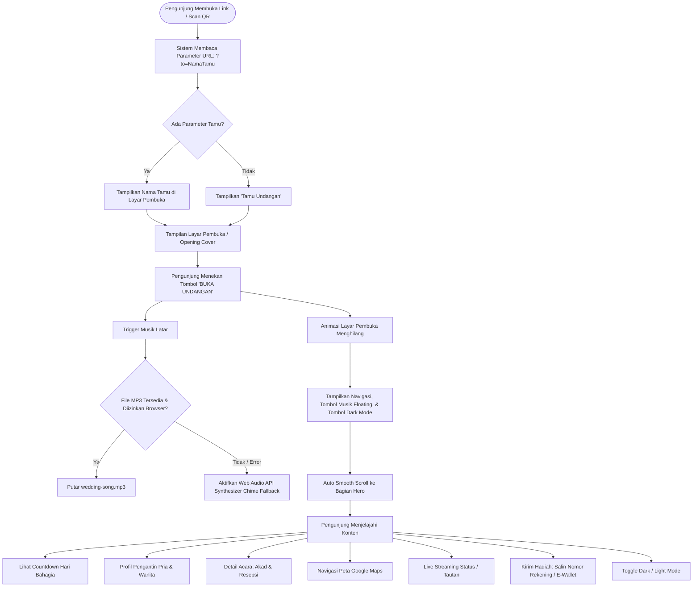
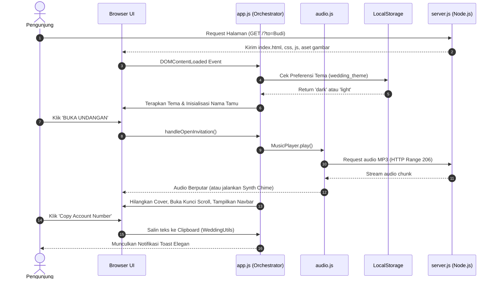
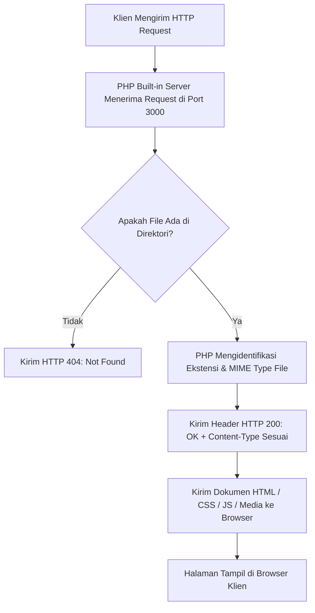

# 📖 DOKUMENTASI SISTEM & ALUR WEBSITE UNDANGAN DIGITAL
**Proyek:** Website Undangan Pernikahan Digital (*The Wedding of Wira & Neera*)  
**Disusun Untuk:** Laporan Tugas / Dokumentasi Presentasi Siswa  
**Teknologi:** HTML5, CSS3, JavaScript (Vanilla ES6+), PHP Native Web Server (Built-in Server)

---

## 📑 DAFTAR ISI
1. [Ringkasan Proyek](#1-ringkasan-proyek)
2. [Arsitektur Sistem](#2-arsitektur-sistem)
3. [Struktur File & Direktori](#3-struktur-file--direktori)
4. [Diagram Alur Sistem (Flowchart)](#4-diagram-alur-sistem-flowchart)
   - [4.1. Alur Pengguna (User Flow / Journey)](#41-alur-pengguna-user-flow--journey)
   - [4.2. Sequence Diagram (Interaksi Komponen)](#42-sequence-diagram-interaksi-komponen)
   - [4.3. Alur Server Web PHP (Request-Response Lifecycle)](#43-alur-server-web-php-request-response-lifecycle)
5. [Penjelasan Rinci Komponen & Modul Kode](#5-penjelasan-rinci-komponen--modul-kode)
   - [A. Web Server PHP (`start.bat`)](#a-web-server-php-startbat)
   - [B. Konfigurasi Terpusat (`assets/js/config.js`)](#b-konfigurasi-terpusat-assetsjsconfigjs)
   - [C. Utilitas & Keamanan (`assets/js/utils.js`)](#c-utilitas--keamanan-assetsjsutilsjs)
   - [D. Sistem Audio & Fallback Synth (`assets/js/audio.js`)](#d-sistem-audio--fallback-synth-assetsjsaudiojs)
   - [E. Penghitung Waktu Mundur (`assets/js/countdown.js`)](#e-penghitung-waktu-mundur-assetsjscountdownjs)
   - [F. Sistem Doa & Ucapan (`assets/js/wishes.js`)](#f-sistem-doa--ucapan-assetsjswishesjs)
   - [G. Orkestrator Utama (`assets/js/app.js`)](#g-orkestrator-utama-assetsjsappjs)
6. [Fitur Unggulan & Aspek Teknis](#6-fitur-unggulan--aspek-teknis)
7. [Panduan Menjalankan Aplikasi](#7-panduan-menjalankan-aplikasi)

---

## 1. Ringkasan Proyek

Website ini merupakan aplikasi web **Undangan Pernikahan Digital Interaktif** yang dibuat untuk membagikan informasi resepsi & akad nikah secara modern, elegan, ramah gawai (*mobile-friendly*), dan ramah aksesibilitas.

### Karakteristik & Sasaran Desain:
* **Personalisasi Tamu:** Menampilkan nama tamu secara dinamis melalui parameter URL (contoh: `?to=Nama+Tamu`).
* **Interaktivitas Penuh:** Transisi pintu masuk (*opening envelope cover*), pemutar musik latar dengan kontrol manual, *countdown timer* waktu-nyata, salin nomor rekening/e-wallet dengan satu klik, tombol tema gelap (*Dark Mode*), serta integrasi Google Maps & siaran langsung (*Live Streaming*).
* **Performa Tinggi:** Tidak bergantung pada pustaka eksternal (*zero-dependency frontend*), menggunakan CSS murni dan JavaScript native yang ringan dan cepat.

---

## 2. Arsitektur Sistem

Website ini mengadopsi model **Client-Server Architecture**:

```
+-------------------------------------------------------------------------+
|                              KLIEN (BROWSER)                            |
|                                                                         |
|  +-------------------+   +-------------------------------------------+  |
|  |     Tampilan      |   |            Logika JavaScript              |  |
|  |   (index.html &   |---|  * config.js (Data Sumber)                |  |
|  |    style.css)     |   |  * audio.js (Web Audio / HTMLAudio)       |  |
|  +-------------------+   |  * countdown.js (Interval Timer)          |  |
|                          |  * utils.js (XSS Safe Sanitizer & Toast)  |  |
|                          |  * app.js (Orchestrator & Observers)      |  |
|                          +-------------------------------------------+  |
|                                                |                        |
|                                       LocalStorage                      |
|                           (Tema Dark/Light & Data Ucapan)               |
+-------------------------------------------------------------------------+
                                    ▲
                                    │ HTTP Request / Stream Audio (206)
                                    ▼
+-------------------------------------------------------------------------+
|                       SERVER (PHP Native Web Server)                    |
|                                                                         |
|   start.bat (php -S localhost:3000)                                     |
|   * Port: 3000                                                          |
|   * PHP Built-in Static File Server                                     |
|   * MIME Type Resolver Otomatis (HTML, CSS, JS, MP3, PNG, SVG, dll.)    |
|   * Zero-Dependency (Tanpa framework luar / Node.js)                    |
+-------------------------------------------------------------------------+
```

---

## 3. Struktur File & Direktori

```
undangan-fatih/
│
├── index.html                  # Struktur utama dokumen HTML (Semantic Elements)
├── start.bat                   # Script Server PHP Native (php -S localhost:3000)
├── qrcode-undangan.png         # Gambar kode QR akses cepat
├── cloudflared.exe             # Tool tunneling (opsional untuk online hosting)
│
└── assets/
    ├── css/
    │   ├── style.css           # Styling utama, CSS variables, & responsive grid
    │   └── animations.css      # Keyframes, transisi halus, & efek scroll
    │
    ├── js/
    │   ├── config.js           # Single Source of Truth (data acara, pengantin, rekening)
    │   ├── utils.js            # Fungsi bantuan: Sanitasi XSS, Clipboard API, Toast
    │   ├── countdown.js        # Logika hitung mundur waktu acara
    │   ├── audio.js            # Pemutar audio MP3 + fallback Web Audio API Synthesizer
    │   ├── wishes.js           # Pengelola form ucapan & penyimpanan LocalStorage
    │   └── app.js              # Controller utama inisialisasi modul & event UI
    │
    ├── images/                 # Aset grafis & kode QR
    └── music/
        └── wedding-song.mp3    # Lagu latar instrumen pernikahan
```

---

## 4. Diagram Alur Sistem (Flowchart)

### 4.1. Alur Pengguna (User Flow / Journey)

Diagram di bawah menggambarkan perjalanan pengunjung dari saat membuka link undangan hingga berinteraksi dengan seluruh fitur:



---

### 4.2. Sequence Diagram (Interaksi Komponen)

Diagram interaksi antara Pengunjung, Browser UI, Script Logika, dan Server:



---

### 4.3. Alur Server Web PHP (Request-Response Lifecycle)

Diagram cara kerja web server native PHP (`php -S localhost:3000`) dalam melayani file:



---

## 5. Penjelasan Rinci Komponen & Modul Kode

### A. Web Server PHP (`start.bat`)
* **Tujuan:** Menyediakan layanan web server lokal secara langsung menggunakan fitur bawaan PHP (*Built-in Web Server*) tanpa memerlukan framework runtime Node.js ataupun modul eksternal.
* **Fitur Utama:**
  1. **Zero-Dependency & Portabel:** Dijalankan cukup dengan mengeklik `start.bat` yang mengeksekusi `php -S localhost:3000`.
  2. **Deteksi Otomatis Lingkungan PHP:** File batch secara cerdas mendeteksi instalasi PHP di sistem maupun direktori Laragon (`H:\laragon\bin\php`).
  3. **Kecepatan & Efisiensi:** Menyajikan dokumen HTML, CSS, JavaScript, gambar, dan file audio secara instan dan ringan untuk keperluan pengujian dan presentasi.

### B. Konfigurasi Terpusat (`assets/js/config.js`)
* **Tujuan:** Menerapkan prinsip *Single Source of Truth* (SSOT).
* **Fungsi:** Menyimpan seluruh data teks dinamis di dalam satu objek global `window.weddingData`:
  * Nama mempelai, deskripsi, foto, akun media sosial.
  * Tanggal & jam acara dalam format ISO (`eventTargetIso: "2026-09-10T08:00:00+07:00"`) untuk akurasi timezone WIB.
  * Detail lokasi gedung, alamat lengkap, dan tautan embed Google Maps.
  * Nomor rekening bank (BCA), E-Wallet (GoPay/OVO), serta alamat pengiriman kado fisik.
  * Tautan siaran langsung (*Live Streaming*).

### C. Utilitas & Keamanan (`assets/js/utils.js`)
* **Tujuan:** Menyediakan fungsi-fungsi pembantu yang digunakan di seluruh aplikasi:
  1. **`sanitizeText(str)`:** Mencegah celah keamanan **Cross-Site Scripting (XSS)** dengan mengubah teks input menjadi representasi teks aman di DOM.
  2. **`getGuestName()`:** Membaca parameter query URL (`?to=...`, `?u=...`, atau `?guest=...`), melakukan dekode karakter URL dengan aman, dan memberikan nilai bawaan *"Tamu Undangan"* jika parameter tidak ditemukan.
  3. **`copyToClipboard(text, message)`:** Menyalin nomor rekening dengan navigator Clipboard API modern dan dilengkapi mekanisme *fallback* `execCommand` untuk peramban lawas.
  4. **`showToast(message, type)`:** Menampilkan notifikasi *floating popup* bergaya modern yang otomatis hilang setelah beberapa detik.

### D. Sistem Audio & Fallback Synth (`assets/js/audio.js`)
* **Tujuan:** Mengelola pemutaran musik latar agar tahan uji (*resilient*).
* **Mekanisme Kerja:**
  * Secara otomatis mencoba memutar lagu `assets/music/wedding-song.mp3`.
  * **Fallback Web Audio API:** Jika file audio tidak ditemukan (404) atau kebijakan browser memblokir format tertentu, sistem secara cerdas beralih ke **Romantic Harmonic Synthesizer** menggunakan *Oscillator Node* Web Audio API yang menghasilkan melodi akor lembut (*chime/piano progression*) tanpa file eksternal.
  * Tombol kontrol mengambang (*floating button*) dengan indikator visual piringan berputar (*spinning vinyl effect*) ketika musik aktif.

### E. Penghitung Waktu Mundur (`assets/js/countdown.js`)
* **Tujuan:** Menghitung sisa waktu menuju waktu akad nikah secara *realtime* (Hari, Jam, Menit, Detik).
* **Keamanan Memori:** Menggunakan `setInterval` per 1 detik dan secara otomatis membersihkan interval menggunakan event `beforeunload` untuk mencegah kebocoran memori (*memory leak*). Ketika waktu telah tiba, sistem menampilkan pesan perayaan.

### F. Sistem Doa & Ucapan (`assets/js/wishes.js`)
* **Tujuan:** Memfasilitasi para tamu untuk menuliskan doa restu.
* **Mekanisme:**
  * Data ucapan disimpan secara lokal pada browser menggunakan **`localStorage`** (`wedding_wishes_wira_neera`).
  * Setiap ucapan baru disanitasi sebelum dimasukkan ke dalam daftar ucapan untuk memastikan tampilan tidak rusak akibat karakter berbahaya.
  * Didesain terstruktur sehingga di masa depan dapat langsung dihubungkan ke REST API atau database Firebase/Supabase.

### G. Orkestrator Utama (`assets/js/app.js`)
* **Tujuan:** Menghubungkan seluruh modul dan mengatur alur interaksi antarmuka (*UI Life Cycle*):
  1. **Inisialisasi Tema:** Membaca preferensi mode gelap (*dark/light*) dari `localStorage` atau preferensi sistem pengguna (`prefers-color-scheme`).
  2. **Inisialisasi Nama Tamu:** Menyuntikkan nama tamu hasil pemrosesan URL ke elemen placeholder.
  3. **Event Pembuka Undangan (`handleOpenInvitation`):**
     * Memulai pemutaran audio.
     * Memberikan animasi penutupan pada cover (`cover-exit`).
     * Membuka kunci scroll halaman (`overflow-hidden` dihilangkan).
     * Memunculkan navbar dan tombol navigasi mengambang.
     * Melakukan *smooth scrolling* ke bagian Hero.
  4. **Animasi Scroll (IntersectionObserver):** Mengamati elemen kelas `.reveal-on-scroll` untuk memberikan efek transisi bertahap (*fade-in / slide-up*) saat pengguna menggulir layar, dengan tetap menghormati preferensi pengguna yang menyalakan `prefers-reduced-motion`.

---

## 6. Fitur Unggulan & Aspek Teknis yang Dapat Dipresentasikan

Saat mempresentasikan website ini kepada guru/penguji, beberapa poin teknis berikut dapat ditonjolkan:

| No | Fitur | Penjelasan Teknis untuk Presentasi |
|---|---|---|
| 1 | **Streaming Audio HTTP 206** | Server backend tidak sekadar mengirim file statis, melainkan mendukung protokol HTTP Range Request sehingga pemutaran audio di perangkat seluler (HP Android/iPhone) stabil dan tidak membebani memori. |
| 2 | **Web Audio Synthesizer Fallback** | Jika file MP3 hilang atau koneksi lambat, JavaScript mampu menghasilkan suara instrumen romantis secara sintetis langsung dari browser menggunakan Web Audio API. |
| 3 | **Pencegahan Keamanan XSS** | Seluruh masukan dari URL (`?to=...`) maupun form ucapan disanitasi menggunakan `sanitizeText` sebelum dicetak ke layar, mencegah injeksi kode berbahaya. |
| 4 | **Satu Sumber Data (SSOT)** | Jika ada perubahan tanggal, lokasi, atau mempelai, pengembang cukup mengubah file `config.js` tanpa perlu mencari dan mengganti satu per satu di file HTML. |
| 5 | **Mobile-First UX** | Dilengkapi dengan *Mobile Bottom Navigation* yang mudah dijangkau oleh ibu jari pengguna gawai ponsel. |
| 6 | **State Persistence** | Pilihan tema Gelap/Terang (*Dark/Light Mode*) tersimpan di `localStorage` peramban sehingga preferensi tidak hilang saat halaman dimuat ulang. |

---

## 7. Panduan Menjalankan Aplikasi

1. **Jalankan Server Lokal (PHP):**
   * Klik dua kali file `start.bat`, atau jalankan melalui terminal:
   ```bash
   start.bat
   ```
   *(Atau jalankan langsung perintah: `php -S localhost:3000`)*
2. **Buka di Peramban Web:**
   * Alamat standar: [http://localhost:3000](http://localhost:3000)
   * Uji coba dengan nama tamu personal: [http://localhost:3000/?to=Bapak+Ahmad+Subagyo](http://localhost:3000/?to=Bapak+Ahmad+Subagyo)
3. **Menguji Mode Mobile:**
   * Buka *Developer Tools* (tekan `F12` atau `Ctrl + Shift + I`), lalu aktifkan *Toggle Device Toolbar* (`Ctrl + Shift + M`).

---
*Dokumentasi ini disusun secara lengkap dan terstruktur sebagai panduan teknis proyek website undangan digital.*
